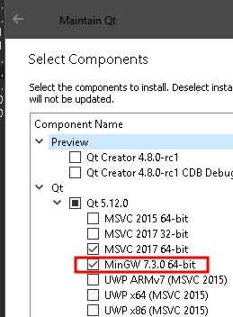
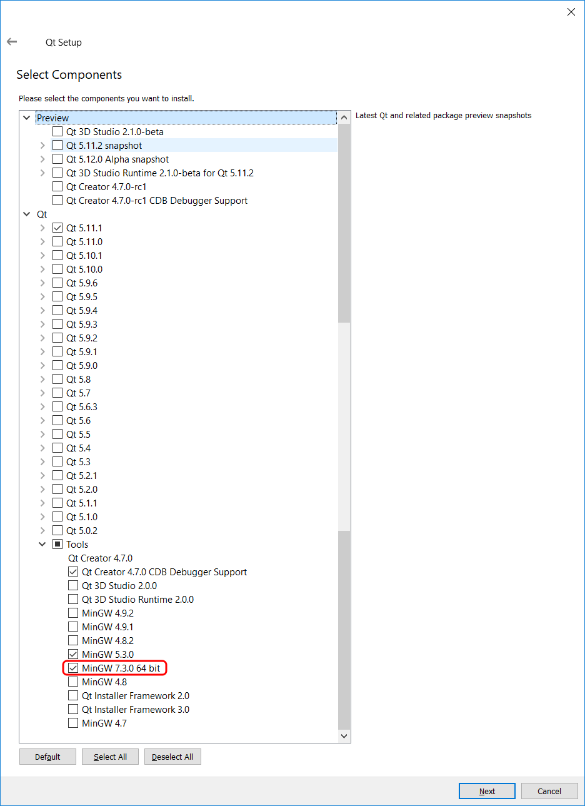

# [Install](install.md) on Windows

  1. Download and install Qt Creator (once)
  2. Download and install SFML (once)
  3. Let Qt Creator find SFML library (once per project file)

## 1. Download and install Qt Creator

Use all defaults, up until the Qt Maintenance tool is started.
Here, you will need to check two boxes:

 * 1. For the highest (stable) Qt version: 
      the highest MinGW :warning: remember this version of MinGW

 * 2. Under tools: that same MinGW :warning: remember this version of MinGW

## 2. Download and install SFML

 * Go to the SFML download page, 
   [https://www.sfml-dev.org/download/sfml/2.5.0/](https://www.sfml-dev.org/download/sfml/2.5.0/)
 * Pick the MinGW version you have installed and download the zip
 * Unpack the zip, it will create a folder called `SFML-2.X.Y` (where X and Y are version numbers)
 * Rename that folder to `sfml`
 * Move that folder to within `C:/Qt`. Its new path will be `C:/Qt/sfml`

## 3. Let Qt Creator find SFML library

If you run the Qt Creator project now, 
you will get a `During Startup program exited with code 0xc0000135` error. 
This means it cannot find the path.

 * In Qt Creator, click 'Projects' (at the left vertical menu bar), 
   go to 'Build', 
   go to 'Build Environment', 
   add to the `Path` variable: `;C:\Qt\sfml\bin`

